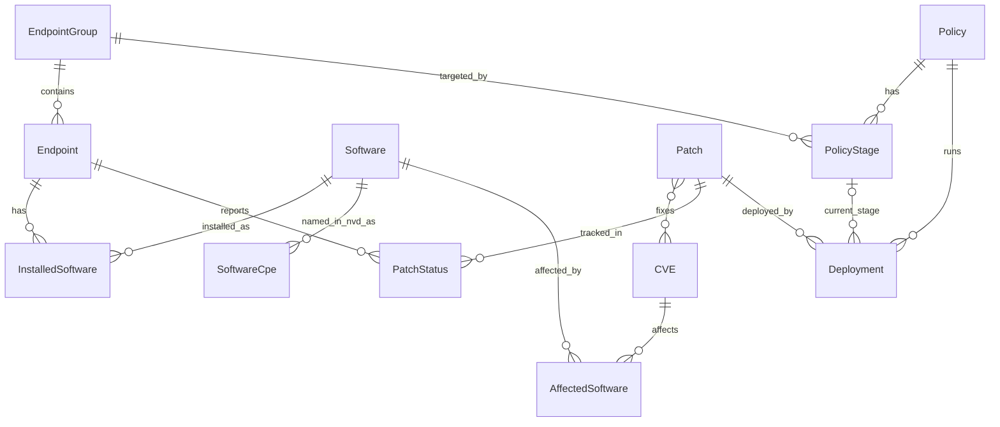

# PRD: mini-patch-manager

PC 여러 대의 소프트웨어 설치 현황과 보안 패치 적용 상태를 모아서 보여 주고, 패치 정책에 따라 단계적으로 배포하는 관리 시스템.

## 1. 기능 목록 (MVP)

| 기능 | 하는 일 |
| --- | --- |
| 에이전트 상태 보고 | 가상 PC(에이전트)가 설치한 소프트웨어와 적용한 KB를 서버에 보고한다. 보고는 즉시 응답하고, 패치 상태 갱신과 패치율 계산은 Celery가 비동기로 처리한다 |
| CVE · KB 검색 | NVD에서 주기적으로 수집한 CVE와 KB 번호로 취약점과 패치를 찾는다 |
| 대시보드 | 전체 패치율과 위험도(CVSS 등급)별 미적용 PC를 보여 준다 |
| 패치 정책 | 그룹(테스트 · 일반 · 예외)별 정책을 만들고 고친다. 정책에 따라 테스트 그룹에 먼저 배포하고 이상이 없으면 전체로 넓힌다. 오류가 보고되면 롤백 표시를 하고 오류 보고 패치로 분류한다 |

범위 결정: 패치 정책은 표 · CRUD API · 동작(단계적 배포, 롤백)까지 모두 MVP에 포함한다.

## 2. 화면 목록

| 화면 | 보여 주고 하는 일 |
| --- | --- |
| 대시보드 | 전체 패치율, 위험도(CVSS 등급)별 미적용 PC, 진행 중인 배포 |
| CVE · KB 검색 | CVE 번호나 KB 번호로 통합 검색. 결과 목록과 상세(영향받는 소프트웨어, 해결하는 KB) |
| PC 목록 | PC와 소속 그룹, 설치된 소프트웨어, 패치 상태. PC 하나를 눌러 상세 확인 |
| 정책 목록 | 정책과 대상 그룹, 현재 배포 단계(테스트 그룹 → 전체) 한눈에 보기 |
| 정책 상세 · 편집 | 정책 새로 만들기와 고치기, 단계별 배포 진행 상태, 오류 보고와 롤백 표시 |

범위 결정: 화면 5개. 정책은 목록, 상세, 편집으로 나누고 PC 목록 화면을 추가한다.

구현 메모: 정책 편집은 한 화면에서 이름 · 최소 위험도 · 실행 시각 · 사용 여부와 **배포 단계 목록**(행 추가 · 삭제 · 위아래 순서 바꾸기, 단계마다 그룹 · 이전 단계 후 대기(분) · 롤백 오류율(%))을 함께 입력하고 한 번에 저장한다. 위에서 아래 순서가 곧 배포 순서(order)다. 정책 이름을 누르면 정책 상세 화면(`/policies/:id`)이 열려 배포 단계, 배포 시작(패치 고르기), 배포 현황(단계별 막대 · 오류율 · 롤백 사유, 진행 중이면 5초마다 자동 갱신)을 보여 준다.

## 3. API 목록

| 화면 · 기능 | API | 하는 일 |
| --- | --- | --- |
| 에이전트 보고 | `POST /api/agents/report` | PC가 설치 SW와 적용 KB를 보고. 즉시 응답하고 처리는 Celery |
| CVE · KB 검색 | `GET /api/search/?q=` | CVE 번호, KB 번호(숫자만도 가능), CVE 설명의 일부로 통합 검색. 2글자 미만이면 400. CVE 번호로 찾으면 그 CVE를 고치는 KB도 함께 준다. 종류별로 최대 20건 |
| | `GET /api/cves/{id}` | CVE 상세 (CVSS, 영향 SW, 해결 KB) |
| | `GET /api/patches/{id}` | 패치(KB) 상세 |
| PC 목록 | `GET /api/endpoints/` | PC 목록. `?group=`(그룹 id), `?status=`(그 상태인 패치가 하나라도 있는 PC), `?search=`(호스트 이름의 일부)로 거르고 50개씩 나눠 준다. 줄마다 미적용 패치 수, 오류 패치 수, 취약한 CVE 수(판단 불가 제외)가 붙는다 |
| | `GET /api/endpoints/{id}` | PC 상세 (설치 SW, 패치 상태, 취약점 판단 결과) |
| | `GET /api/groups` | 그룹 목록 (필터와 정책 편집에서 그룹을 고르는 데 사용) |
| 대시보드 | `GET /api/dashboard/summary` | 패치율, 위험도별 미적용 PC, 진행 중 배포 |
| 정책 목록 · 편집 | `GET, POST /api/policies/` | 정책 목록과 새로 만들기(배포 단계를 함께 보낸다). 이름이 겹치면 400 "같은 이름의 정책이 이미 있습니다.", 롤백 오류율이 0~1 밖이거나 단계 순서가 겹치면 400. 서버 오류 문구는 한국어 |
| | `GET, PUT, DELETE /api/policies/{id}` | 정책 상세, 수정, 삭제 |
| 단계적 배포 | `POST /api/policies/{id}/deploy/` | 배포 시작. 본문 `{"patch": 번호}`, 한 번에 패치 하나. 1단계(보통 테스트 그룹)부터 시작하고 `201`로 진행 상태를 돌려준다. 꺼 둔 정책 · 단계 없음 · 정책의 최소 위험도에 못 미치는 패치는 `400`, 그 패치의 배포가 이미 진행 중이면 `409` |
| | `GET /api/policies/{id}/status/` | 이 정책의 배포 진행 상태(최근 20건). 배포마다 상태(진행 중 · 완료 · 롤백됨), 롤백 사유, 단계별 대상 PC 수 · 적용 · 오류 · 미적용 · 롤백 수 · 오류율 · 단계 상태(끝남 · 진행 중 · 대기 중 · 롤백 기준 초과 · 실행 전) |
| | `GET /api/patches/` | 패치(KB) 목록. `?policy=<정책 id>`를 주면 그 정책으로 배포할 수 있는 패치(최소 위험도 이상이고 진행 중인 배포가 없는 것)만 준다 |
| 에이전트 지시 | `GET /api/agents/{호스트}/tasks/` | 에이전트가 서버에 물어서 가져가는 일: `install`(설치해도 되는 KB), `uninstall`(롤백되어 제거할 KB). 등록되지 않은 PC는 `404` |

모든 주소는 끝에 `/`를 붙여 호출한다 (예: `POST /api/agents/report/`).

### 에이전트 보고 요청 모양

`POST /api/agents/report/`. PC가 자기 상태만 알리고, 패치별 상태(적용 · 미적용 · 오류)는 서버가 정한다. 형식을 확인하고 바로 `202 Accepted`로 응답하며, 처리는 Celery 작업이 한다. 등록되지 않은 PC는 `404`, 형식이 틀리면 `400`.

```json
{
  "hostname": "pc-001",
  "os_name": "Windows 10 22H2",
  "os_build": "10.0.19045.4000",
  "installed_software": [{"name": "Google Chrome", "vendor": "Google", "version": "130.0"}],
  "installed_kbs": ["KB5044273"],
  "errors": [{"kb_number": "KB5044285", "error_code": "0x80070643"}]
}
```

- `installed_software`는 전체 목록이다. 서버는 목록에 없는 소프트웨어를 지운다.
- 서버는 PC의 `os_name`과 `target_os`가 같은 패치만 판단한다. KB가 `errors`에 있으면 오류, `installed_kbs`에 있으면 적용, 둘 다 없으면 미적용이다. 롤백된 패치는 미적용으로 보고해도 롤백 상태를 유지한다.
- 패치를 오류로 보고한 PC가 하나라도 있으면 그 패치의 `is_error_reported`가 true가 되고, 모두 사라지면 false가 된다.

### 대시보드 요약 (현재 범위)

`GET /api/dashboard/summary/`는 아래를 준다. 진행 중인 배포와 패치(KB) 기준의 위험도별 미적용 PC는 화면을 만들 때 더한다.

- 패치율(적용 / 전체), 상태별 건수, 보고한 PC 수
- `software_vulnerable_endpoints_by_severity`: 설치된 소프트웨어 버전이 CVE의 영향 범위에 들어가는 PC 수를 위험도(critical · high · medium · low · unscored)별로 센 값. 한 PC가 여러 등급에 걸리면 각각 센다
- `unknown_assessments`: 버전을 읽지 못해 판단하지 못한 건수 (취약으로 세지 않는다)

### 배포 규칙 (정책에 따른 동작)

`patchmgr/deployment.py`가 맡는다. 정한 것은 `file/README.md`의 「정한 것」 표에 까닭과 함께 있다.

1. **시작**: `POST /api/policies/{id}/deploy/`에 패치 하나를 지정한다. 정책이 켜져 있고, 단계가 있고, 패치가 해결하는 CVE 중 정책의 최소 위험도 이상인 것이 있고, 그 패치의 진행 중인 배포가 없어야 한다(DB 제약으로도 보장). 시작하면 1단계에 들어가고, 이전에 롤백됐거나 설치에 실패한 PC의 상태는 처음(미적용)으로 되돌린다.
2. **지시 전달**: 에이전트가 `GET /api/agents/{호스트}/tasks/`로 묻는다. 진행 중인 배포의 **현재 단계 그룹**에 속하고, 패치의 **대상 Windows**와 같고, 그 단계의 **대기 시간이 지났고**, 아직 **설치 전(미적용)**인 PC에게만 `install`이 나간다. 설치에 실패한 PC에게는 다시 지시하지 않는다.
3. **오류율** = 오류인 PC 수 ÷ 그 단계 그룹의 대상 PC 전체(패치의 대상 Windows인 PC). 아직 시도하지 않은 PC도 분모에 넣어 표본이 적을 때 성급하게 롤백하지 않는다.
4. **점검**: 진행 중인 배포를 Celery Beat가 1분마다(`DEPLOY_CHECK_SECONDS`), 그리고 에이전트 보고를 처리한 직후에도 점검한다.
   - 단계의 오류율이 롤백 기준을 **넘으면**(같으면 아님) 롤백한다.
   - 단계의 대상 PC가 모두 결과(적용 · 오류)를 냈으면 다음 단계로 넘긴다. 다음 단계는 이전 단계가 끝난 시각 + 그 단계의 대기 시간(분) 뒤에 설치 지시가 나간다. 대상 PC가 없는 단계는 바로 넘어간다. 마지막 단계까지 끝나면 완료한다.
5. **롤백**: 지금까지 지시가 나간 단계에서 **적용된 PC는 "롤백" 상태**로 바꾸고(에이전트는 `uninstall` 목록을 보고 제거), 설치에 실패한 PC는 그대로 둔다. 롤백된 PC는 새 배포가 시작되기 전까지 KB가 아직 남아 있다고 보고해도 롤백 상태를 유지한다. 배포에는 롤백 사유(`note`)가 남고, 패치는 **오류 보고 패치**로 분류된다(오류 PC가 남아 있거나 가장 최근 배포가 롤백이면 유지).
6. **보호**: 진행 중인 배포가 있는 정책은 배포 단계를 바꿀 수 없고(`400`) 삭제할 수 없다(`409`). 정책의 다른 값(이름, 사용 여부 등)은 바꿀 수 있다.
7. **한계**: 오래 보고하지 않는 PC가 있으면 그 단계가 "모두 결과를 냄"에 도달하지 못해 멈춘다(시간 제한은 넣지 않았다). 오류율의 분모에도 그 PC가 남는다. 수동 승인(단계마다 사람이 누르기)은 없다. 정책의 **실행 시각(`start_time`)은 저장만 하고 배포 로직에서는 쓰지 않는다**(배포는 시작을 누른 즉시 1단계로 들어간다). 실행 주기도 없다.

### 버전 비교 규칙

PC에 설치된 버전이 `AffectedSoftware` 한 줄의 범위에 들어가는지 판단하는 규칙이다 (`patchmgr/versions.py`).

- 버전은 숫자로 풀어서 비교한다(`9.0` < `10.0`). 표준 도구 `packaging`을 쓰고, 읽지 못하는 Java식 `8u421`만 `8.0.421`로 바꿔서 읽는다.
- 범위 칸은 이상 · 초과 · 이하 · 미만 · 정확히 다섯 가지이고, 모두 비어 있으면 모든 버전이 해당된다.
- 결과는 해당됨 / 해당되지 않음 / 판단 불가 세 가지다. 설치 버전이나 범위의 버전을 읽지 못하면 판단 불가로 따로 표시하고 취약으로 세지 않는다. 읽을 수 있는 조건 중 하나라도 어긋나면 나머지를 읽지 못해도 해당되지 않는다.
- 같은 CVE에 범위가 여러 줄이면 하나라도 해당되면 취약이다.
- 한계: Oracle Java는 NVD가 `1.8.0` + `update421` 식으로 적는 경우가 있어 `8u421`과 맞지 않을 수 있다. [미확인]

## 4. ERD



| 표 | 주요 칸 | 설명 |
| --- | --- | --- |
| EndpointGroup | name | 테스트 · 일반 · 예외. Django 기본 `Group`과 이름이 겹쳐서 `EndpointGroup`으로 한다 |
| Endpoint | hostname, os_name, os_build, group, last_reported_at | 가상 PC 한 대 |
| Software | name, vendor | 소프트웨어 종류 |
| InstalledSoftware | endpoint, software, version | PC에 설치된 SW와 버전. (endpoint, software)는 한 줄 |
| CVE | cve_id, description, cvss_score, severity, published_at | NVD에서 수집. severity는 CVSS 3.1 등급(Low · Medium · High · Critical) |
| SoftwareCpe | software, vendor, product | 우리 소프트웨어와 NVD의 제조사:제품 이름(CPE)을 잇는 매핑. 소프트웨어 하나에 NVD 이름이 여러 개일 수 있어(Adobe Reader 2개, Notepad++ 제조사 3개, 한컴오피스는 버전마다 제품이 따로) 칸이 아니라 표로 둔다. 계획에 없던 표 |
| AffectedSoftware | cve, software, version_start_including, version_start_excluding, version_end_including, version_end_excluding, version_exact | 어느 SW의 어느 버전이 영향받는지. NVD의 버전 범위 네 가지(이상 · 초과 · 이하 · 미만)와 특정 버전 하나를 그대로 담는다. 모두 비면 모든 버전이 해당. CVE를 수집할 때 SoftwareCpe로 우리 소프트웨어와 이어지는 것만 저장한다. 계획에 없던 연결표 |
| Patch | kb_number, title, target_os, fixed_build, release_date, download_url, is_error_reported | KB 하나. 같은 CVE라도 Windows 종류마다 KB가 다르므로 target_os를 둔다. is_error_reported는 오류 보고 패치 분류용 |
| Patch ↔ CVE | (다대다) | KB 하나가 여러 CVE를 고치고, CVE 하나를 여러 KB가 고친다 |
| PatchStatus | endpoint, patch, status, error_code, reported_at | PC와 패치 한 쌍당 한 줄. status는 미적용 · 적용 · 오류 · 롤백. (endpoint, patch)는 한 줄 |
| Policy | name, min_severity, start_time, is_active | 정책 본체. min_severity 이상인 패치가 대상 |
| PolicyStage | policy, order, group, delay_minutes, rollback_error_rate | 정책의 배포 단계. order 1이 테스트 그룹, 마지막이 전체. 이전 단계 후 delay_minutes를 기다리고, 이 단계의 오류율이 rollback_error_rate를 넘으면 롤백 |
| Deployment | policy, patch, current_stage, state, started_at, finished_at | 정책을 패치 하나에 실제로 실행한 기록. state는 진행 중 · 완료 · 롤백됨. 계획에 없던 표 |

범위 결정: 정책의 배포 단계는 별도 표(PolicyStage)로 나눠 N단계까지 허용한다.

범위 결정: CVE와 소프트웨어는 `SoftwareCpe` 매핑 표로 잇는다. NVD CPE API에서 직접 조회해 확인한 이름만 매핑하며, Slack(NVD에서 데스크톱 제품을 찾지 못함)과 AhnLab V3(같은 제품인지 확인하지 못함)는 매핑 없이 둔다. 표는 모두 12개다.
