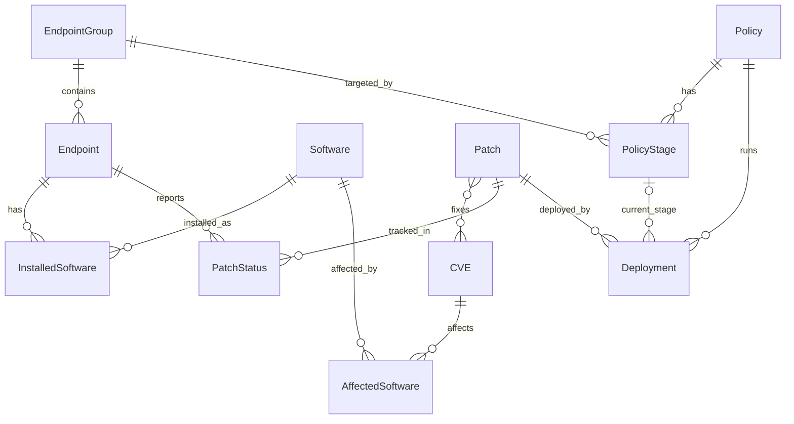

# PRD: mini-patch-manager

PC 여러 대의 소프트웨어 설치 현황과 보안 패치 적용 상태를 모아서 보여 주고, 패치 정책에 따라 단계적으로 배포하는 관리 시스템.

## 1. 기능 목록 (MVP)

| 기능 | 하는 일 |
| --- | --- |
| 에이전트 상태 보고 | 가상 PC(에이전트)가 설치한 소프트웨어와 적용한 KB를 서버에 보고한다. 보고는 즉시 응답하고, 패치 상태 갱신과 패치율 계산은 Celery가 비동기로 처리한다 |
| CVE · KB 검색 | NVD에서 주기적으로 수집한 CVE와 KB 번호로 취약점과 패치를 찾는다 |
| 대시보드 | 전체 패치율과 위험도(CVSS 등급)별 미적용 PC를 보여 준다 |
| 패치 정책 | 그룹(테스트 · 일반 · 예외)별 정책을 만들고 고친다. 정책에 따라 테스트 그룹에 먼저 배포하고 이상이 없으면 전체로 넓힌다. 오류가 보고되면 롤백 표시를 하고 오류 보고 패치로 분류한다 |

범위 결정: 패치 정책은 표 · CRUD API · 동작(단계적 배포, 롤백)까지 모두 MVP에 포함한다.

## 2. 화면 목록

| 화면 | 보여 주고 하는 일 |
| --- | --- |
| 대시보드 | 전체 패치율, 위험도(CVSS 등급)별 미적용 PC, 진행 중인 배포 |
| CVE · KB 검색 | CVE 번호나 KB 번호로 통합 검색. 결과 목록과 상세(영향받는 소프트웨어, 해결하는 KB) |
| PC 목록 | PC와 소속 그룹, 설치된 소프트웨어, 패치 상태. PC 하나를 눌러 상세 확인 |
| 정책 목록 | 정책과 대상 그룹, 현재 배포 단계(테스트 그룹 → 전체) 한눈에 보기 |
| 정책 상세 · 편집 | 정책 새로 만들기와 고치기, 단계별 배포 진행 상태, 오류 보고와 롤백 표시 |

범위 결정: 화면 5개. 정책은 목록, 상세, 편집으로 나누고 PC 목록 화면을 추가한다.

## 3. API 목록

| 화면 · 기능 | API | 하는 일 |
| --- | --- | --- |
| 에이전트 보고 | `POST /api/agents/report` | PC가 설치 SW와 적용 KB를 보고. 즉시 응답하고 처리는 Celery |
| CVE · KB 검색 | `GET /api/search?q=` | CVE 번호나 KB 번호로 통합 검색 |
| | `GET /api/cves/{id}` | CVE 상세 (CVSS, 영향 SW, 해결 KB) |
| | `GET /api/patches/{id}` | 패치(KB) 상세 |
| PC 목록 | `GET /api/endpoints` | PC 목록 (그룹, 패치 상태 필터) |
| | `GET /api/endpoints/{id}` | PC 상세 (설치 SW, 패치 상태) |
| | `GET /api/groups` | 그룹 목록 (필터와 정책 편집에서 그룹을 고르는 데 사용) |
| 대시보드 | `GET /api/dashboard/summary` | 패치율, 위험도별 미적용 PC, 진행 중 배포 |
| 정책 목록 · 편집 | `GET, POST /api/policies` | 정책 목록과 새로 만들기 |
| | `GET, PUT, DELETE /api/policies/{id}` | 정책 상세, 수정, 삭제 |
| 단계적 배포 | `POST /api/policies/{id}/deploy` | 배포 시작 (테스트 그룹 먼저) |
| | `GET /api/policies/{id}/status` | 단계별 진행 상태, 오류 보고, 롤백 표시 |

모든 주소는 끝에 `/`를 붙여 호출한다 (예: `POST /api/agents/report/`).

### 에이전트 보고 요청 모양

`POST /api/agents/report/`. PC가 자기 상태만 알리고, 패치별 상태(적용 · 미적용 · 오류)는 서버가 정한다. 형식을 확인하고 바로 `202 Accepted`로 응답하며, 처리는 Celery 작업이 한다. 등록되지 않은 PC는 `404`, 형식이 틀리면 `400`.

```json
{
  "hostname": "pc-001",
  "os_name": "Windows 10 22H2",
  "os_build": "10.0.19045.4000",
  "installed_software": [{"name": "Google Chrome", "vendor": "Google", "version": "130.0"}],
  "installed_kbs": ["KB5044273"],
  "errors": [{"kb_number": "KB5044285", "error_code": "0x80070643"}]
}
```

- `installed_software`는 전체 목록이다. 서버는 목록에 없는 소프트웨어를 지운다.
- 서버는 PC의 `os_name`과 `target_os`가 같은 패치만 판단한다. KB가 `errors`에 있으면 오류, `installed_kbs`에 있으면 적용, 둘 다 없으면 미적용이다. 롤백된 패치는 미적용으로 보고해도 롤백 상태를 유지한다.
- 패치를 오류로 보고한 PC가 하나라도 있으면 그 패치의 `is_error_reported`가 true가 되고, 모두 사라지면 false가 된다.

### 대시보드 요약 (현재 범위)

`GET /api/dashboard/summary/`는 패치율(적용 / 전체), 상태별 건수, 보고한 PC 수를 준다. 위험도별 미적용 PC와 진행 중인 배포는 Day 4에 더한다.

## 4. ERD



| 표 | 주요 칸 | 설명 |
| --- | --- | --- |
| EndpointGroup | name | 테스트 · 일반 · 예외. Django 기본 `Group`과 이름이 겹쳐서 `EndpointGroup`으로 한다 |
| Endpoint | hostname, os_name, os_build, group, last_reported_at | 가상 PC 한 대 |
| Software | name, vendor | 소프트웨어 종류 |
| InstalledSoftware | endpoint, software, version | PC에 설치된 SW와 버전. (endpoint, software)는 한 줄 |
| CVE | cve_id, description, cvss_score, severity, published_at | NVD에서 수집. severity는 CVSS 3.1 등급(Low · Medium · High · Critical) |
| AffectedSoftware | cve, software, version_start, version_end_excluding | 어느 SW의 어느 버전이 영향받는지 (NVD의 CPE 범위). 계획에 없던 연결표 |
| Patch | kb_number, title, target_os, fixed_build, release_date, download_url, is_error_reported | KB 하나. 같은 CVE라도 Windows 종류마다 KB가 다르므로 target_os를 둔다. is_error_reported는 오류 보고 패치 분류용 |
| Patch ↔ CVE | (다대다) | KB 하나가 여러 CVE를 고치고, CVE 하나를 여러 KB가 고친다 |
| PatchStatus | endpoint, patch, status, error_code, reported_at | PC와 패치 한 쌍당 한 줄. status는 미적용 · 적용 · 오류 · 롤백. (endpoint, patch)는 한 줄 |
| Policy | name, min_severity, start_time, is_active | 정책 본체. min_severity 이상인 패치가 대상 |
| PolicyStage | policy, order, group, delay_minutes, rollback_error_rate | 정책의 배포 단계. order 1이 테스트 그룹, 마지막이 전체. 이전 단계 후 delay_minutes를 기다리고, 이 단계의 오류율이 rollback_error_rate를 넘으면 롤백 |
| Deployment | policy, patch, current_stage, state, started_at, finished_at | 정책을 패치 하나에 실제로 실행한 기록. state는 진행 중 · 완료 · 롤백됨. 계획에 없던 표 |

범위 결정: 정책의 배포 단계는 별도 표(PolicyStage)로 나눠 N단계까지 허용한다.
