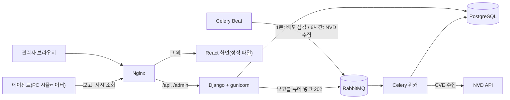

# mini-patch-manager

PC 여러 대의 소프트웨어와 패치 적용 상태를 모아 보여 주고, 정책에 따라 **단계적으로 배포하고 오류가 많으면 자동으로 롤백**하는 미니 패치 관리 시스템입니다. 실제 PC 대신 가상 PC(에이전트 시뮬레이터)로 동작을 시연하는 개인 포트폴리오 프로젝트입니다.

> 이 README는 초안입니다. 아키텍처 그림 보강, 기술 선택 이유, 트러블슈팅, 성능 표, 데모 GIF는 정리 단계에서 더합니다.

## 할 수 있는 것

- **취약점 수집**: NVD(미국 국립 취약점 데이터베이스)에서 CVE를 주기적으로 가져와 점수와 영향받는 소프트웨어(버전 범위)를 저장합니다.
- **취약 판단**: PC에 설치된 소프트웨어 버전이 CVE의 영향 범위에 들어가는지 비교합니다. 버전을 읽지 못하면 "판단 불가"로 따로 셉니다.
- **에이전트 보고**: PC가 설치된 소프트웨어와 KB를 보고하면 서버는 즉시 `202`로 응답하고, 패치 상태 갱신은 Celery가 비동기로 처리합니다.
- **단계적 배포와 자동 롤백**: 정책(테스트 그룹 → 일반 그룹 …)에 따라 현재 단계의 PC에게만 설치 지시가 나가고, 단계의 오류율이 기준을 넘으면 롤백합니다.
- **관리자 화면**: 대시보드, CVE·KB 검색, PC 목록과 상세, 정책 만들기·편집, 배포 시작과 단계별 진행 상태(자동 갱신).

## 구조



백엔드 이미지는 Rocky Linux 9 + Python 3.12 기반이고, API(gunicorn), Celery 워커, Celery Beat, 초기화 작업이 같은 이미지를 명령만 바꿔서 씁니다.

## 빠른 시작 (Docker)

필요한 것: Docker Desktop (Compose 포함)

```
docker compose up --build
```

- 화면: http://127.0.0.1:8080 (윈도우에서는 `localhost`보다 `127.0.0.1`이 빠릅니다)
- API 문서(Swagger): http://127.0.0.1:8080/api/docs/
- 관리자: http://127.0.0.1:8080/admin/ (계정은 `docker compose exec backend python3.12 manage.py createsuperuser`로 만듭니다)
- RabbitMQ 관리 화면: http://127.0.0.1:15672 (guest / guest)

처음 켜면 `init` 서비스가 한 번 실행되어 DB 표를 만들고 시연 데이터(그룹 3개, 소프트웨어 20종, PC 50대, 정책 1개, 샘플 패치)를 넣고, 알려진 실제 CVE 5개를 NVD에서 가져옵니다. 인터넷이 없으면 CVE 가져오기만 건너뜁니다. 다시 켜도 데이터가 겹치지 않고, `docker compose down`으로 꺼도 DB는 남습니다.

| 명령 | 하는 일 |
| --- | --- |
| `.env`에 `SEED_DEMO=0`을 적고 `docker compose up --build` | 시연 데이터 없이 빈 DB로 시작 (운영체제와 상관없이 같은 방법) |
| `docker compose up -d db mq` | DB와 큐만 켜기 (아래 개발 환경용) |
| `docker compose down -v` | 모두 끄고 DB 데이터도 지우기 |

NVD API 키는 선택입니다. 프로젝트 폴더에 `.env` 파일을 만들고 `NVD_API_KEY=값`을 적으면 compose가 읽습니다(`.env.example` 참고). 키가 없으면 NVD 호출 사이에 6.5초씩 기다립니다.

### 시연 순서: 단계적 배포와 롤백

1. 화면의 **정책**에서 "높음 이상 단계 배포"를 열고, 2단계의 대기 시간이 60분이므로 **편집**에서 0분으로 바꿉니다.
2. **정책 상세**에서 패치(예: KB5044273)를 고르고 **배포 시작**을 누릅니다.
3. 가상 PC들이 서버에 접속해 설치하는 것을 흉내 냅니다. 여러 번 실행하면 화면의 단계가 저절로 넘어갑니다.
   ```
   docker compose exec backend python3.12 manage.py simulate_agents
   ```
4. 롤백을 보려면 설치 실패 확률을 높여서 실행합니다.
   ```
   docker compose exec backend python3.12 manage.py simulate_agents --error-rate 0.8
   ```

## 개발 환경 (직접 실행)

백엔드는 Python 3.12 이상(개발은 3.13)이 필요합니다.

```
docker compose up -d db mq                   # DB와 큐
cd backend
python -m venv .venv
.venv\Scripts\python -m pip install -r requirements.txt
.venv\Scripts\python manage.py migrate
.venv\Scripts\python manage.py seed_demo
.venv\Scripts\python manage.py runserver 127.0.0.1:8000
.venv\Scripts\celery -A config worker -P solo -l info    # 윈도우는 -P solo
.venv\Scripts\celery -A config beat -l info
cd ../frontend
npm install
npm run dev -- --host 127.0.0.1               # http://127.0.0.1:5173
```

테스트: `cd backend` 후 `.venv\Scripts\python manage.py test patchmgr`, 화면은 `npm run build`와 `npm run lint`.

## 설계 문서

- [PRD.md](PRD.md): 기능, 화면, API, ERD, 에이전트 보고 형식, 버전 비교 규칙, **배포 규칙**
- [frontend/README.md](frontend/README.md): 화면 목록과 구조

## 알려진 한계

- 오래 보고하지 않는 PC가 있으면 그 단계가 멈춥니다(시간 제한이 없습니다).
- 정책의 "실행 시각"은 저장만 하고 배포에는 쓰지 않습니다. 실행 주기와 수동 승인도 없습니다.
- 인증이 없습니다(누구나 API를 호출할 수 있습니다). 로컬 시연용입니다.
- Compose의 비밀 값(`DJANGO_SECRET_KEY`의 기본값, DB와 RabbitMQ 계정)은 로컬 시연용입니다. 실제로 배포한다면 바꿔야 합니다.
